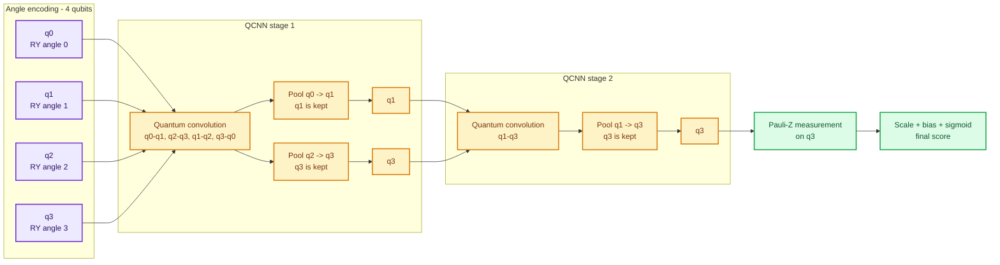

# BreastMNIST QCNN model architecture

Model ID: `breastmnist-qcnn`  
Architecture: four-qubit hierarchical quantum convolutional neural network  
Purpose: research-only binary image-classification demonstration

## Training snapshot

This compact QCNN was trained on **32 BreastMNIST images**, validated on **16**, and tested on **32**, using **2 epochs** with batches of 8. The experiment configured an 18-trial search space for batch size, learning rate, weight decay, and starting-weight scale; the saved smoke run used Adam with a `0.01` learning rate, `0.0001` weight decay, and `0.05` starting scale. In total, the model learned just **38 values**, while its decision threshold was selected from the validation results. This is an early research demonstration, not a clinically trained system.

## Architecture at a glance

```mermaid
flowchart LR
    A["Input image<br/>PNG or JPEG"]
    B["Image preparation<br/>grayscale + 28 x 28 resize"]
    C["Spatial reduction<br/>four 14 x 14 region means"]
    D["Feature scaling<br/>4 intensities -> 4 angles in [-pi, pi]"]
    E["Angle encoding<br/>RY(angle) on q0, q1, q2, q3"]
    F["QCNN stage 1<br/>quantum convolution + pooling<br/>4 active qubits -> 2"]
    G["QCNN stage 2<br/>quantum convolution + pooling<br/>2 active qubits -> 1"]
    H["Quantum readout<br/>Pauli-Z expectation on final qubit"]
    I["Learned output head<br/>scale + bias + sigmoid"]
    J{"Score >= 0.4122?"}
    K["Malignant class"]
    L["Normal or benign class"]

    A --> B --> C --> D --> E --> F --> G --> H --> I --> J
    J -->|Yes| K
    J -->|No| L

    classDef input fill:#EDE9FE,stroke:#6D28D9,color:#2E1065,stroke-width:2px;
    classDef classical fill:#DBEAFE,stroke:#2563EB,color:#172554,stroke-width:2px;
    classDef quantum fill:#FEF3C7,stroke:#D97706,color:#78350F,stroke-width:2px;
    classDef output fill:#DCFCE7,stroke:#16A34A,color:#14532D,stroke-width:2px;
    classDef decision fill:#FCE7F3,stroke:#DB2777,color:#831843,stroke-width:2px;

    class A input;
    class B,C,D classical;
    class E,F,G,H quantum;
    class I classical;
    class J decision;
    class K,L output;
```

## Circuit-level qubit flow: 4 -> 2 -> 1

During pooling, the **source** qubit passes its information forward and then stops. The **sink** qubit keeps the combined information and continues to the next stage. Here, `q1` and `q3` survive stage 1, and `q3` survives stage 2.

## Implemented circuit and saved weights

This is the real model used by the portal, not a generic QCNN example. The image becomes four numbers that control four qubits. Two stages reduce them from four qubits to two, then from two to one. The last qubit produces the score.

| Circuit part | What the model uses |
| --- | --- |
| Input | One `RY` rotation for each of the four image values |
| Pattern learning | `U3`, `IsingXX`, `IsingYY`, and `IsingZZ` gates |
| Size reduction | Controlled `RZ`, `RX`, and `RY` gates; one qubit from each pair is kept |
| Final reading | Pauli-Z measurement on the last qubit |

The saved model contains 38 learned values:

| Saved weights | Shape | Values | What they control |
| --- | ---: | ---: | --- |
| `conv_weights` | `2 x 15` | 30 | How qubit pairs learn patterns in the two stages |
| `pool_weights` | `2 x 3` | 6 | How each stage keeps and combines information |
| `output_scale` | one number | 1 | Strength of the final score |
| `output_bias` | one number | 1 | Final score adjustment |
| **Total** |  | **38** | Learned values used by the model |

The weights are stored in `qml_inference/artifacts/v1/qcnn/breastmnist/checkpoint.pt`. Each stage reuses its weights across the qubit pairs it processes. The saved decision threshold is `0.4121575951576233`.

## Evidence boundary

This model was trained on only 32 BreastMNIST images for two epochs. It is a research demonstration, not a medical diagnosis tool.

## Implementation sources

- `qml_inference/qcnn.py` - image preparation, quantum circuit, and final score.
- `qml_inference/artifacts/v1/qcnn/breastmnist/serving.json` - saved model setup and threshold.
