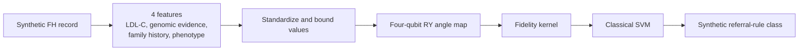
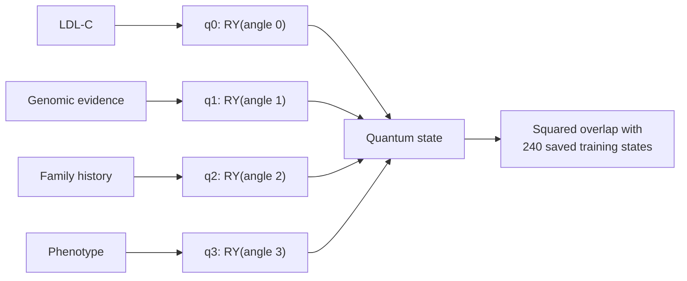

# Synthetic FH Angle QKSVM architecture

Model ID: **fh-angle-qksvm-rule-reproduction**  
Portal status: runnable  
Purpose: reproduce a synthetic familial-hypercholesterolemia referral rule

## Training snapshot

The model used **240 synthetic training records** and **120 synthetic test records**. It has no epochs or trainable circuit weights. Four fixed features were standardized and mapped to four qubits; a classical SVM used fixed C = 1.0. The seed was 26139.

## Architecture

## Four-qubit circuit flow

The quantum circuit turns the four synthetic inputs into a state. Similarities to the saved training states become inputs to the SVM.

## Evidence boundary

The labels were generated from a synthetic referral rule. The strong saved score measures rule reproduction, not FH detection or clinical performance.

## Implementation sources

- scripts/build_fh_synthetic_models.py
- qml_inference/artifacts/v1/fh/model_evidence.json

