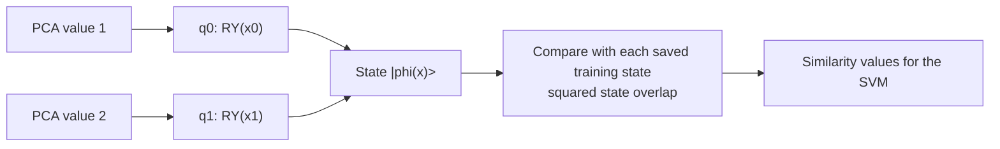

# Framingham Angle QKSVM PCA-2 architecture

Model ID: **framingham-angle-qksvm-pca2**  
Portal status: runnable  
Purpose: educational 10-year CHD risk benchmark

## Training snapshot

Each audited seed used **256 training rows** and **597 held-out test rows** from the Framingham teaching cohort. There are no training epochs or learned quantum-gate weights: the circuit creates a two-qubit similarity score, while a classical SVM learns the boundary. The SVM strength C was selected from 0.1, 1.0, and 10.0 using tuning data. Results were repeated across three seeds.

## Architecture

```mermaid
flowchart LR
    A["15 baseline health fields"]
    B["Fold-local preparation<br/>missing values + scaling"]
    C["PCA reduction<br/>15 fields -> 2 values"]
    D["Two-qubit angle map<br/>RY on q0 and q1"]
    E["Quantum similarity<br/>fidelity with training states"]
    F["Kernel matrix"]
    G["Classical SVM"]
    H["Calibration + saved threshold"]
    I["10-year CHD research class"]
    A --> B --> C --> D --> E --> F --> G --> H --> I
```

## Two-qubit circuit flow

The two qubits are independent during encoding. The quantum part supplies similarities; the SVM and probability calibration remain classical.

## Evidence boundary

This is an educational benchmark using cached ideal-simulator states. It is not clinical validation, a QPU result, or evidence of quantum advantage.

## Implementation sources

- qml-research/src/qml_research/framingham/benchmark.py
- qml-research/src/qml_research/quantum/kernels.py

