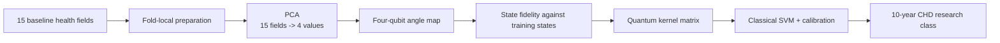
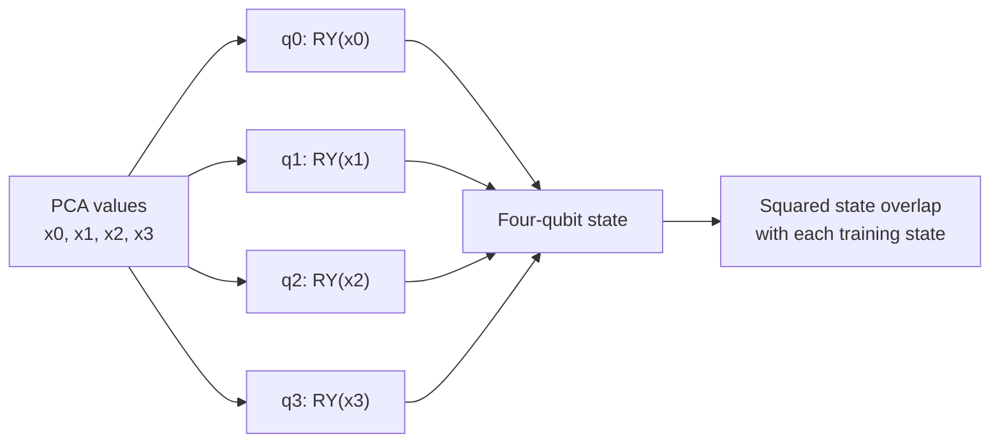

# Framingham Angle QKSVM PCA-4 architecture

Model ID: **framingham-angle-qksvm-pca4**  
Portal status: evidence only  
Purpose: four-feature educational quantum-kernel comparison

## Training snapshot

Each of three seeds used **256 training rows** and **597 held-out test rows**. PCA reduced the prepared health data to four values. The circuit has no learned gate weights and therefore no epochs; the classical SVM tested C = 0.1, 1.0, 10.0 on tuning data.

## Architecture

## Four-qubit circuit flow

The four-qubit version keeps twice as many PCA values as the runnable two-qubit model, but otherwise uses the same angle-kernel design.

## Evidence boundary

This registry entry preserves a simulator-only research result and cannot run new portal predictions.

## Implementation sources

- qml-research/src/qml_research/framingham/benchmark.py
- qml-research/src/qml_research/quantum/kernels.py

