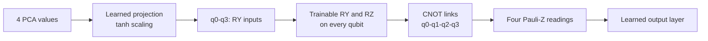

# Framingham BCE HQMLP PCA-4 architecture

Model ID: **framingham-hqmlp-bce-pca4**  
Portal status: evidence only  
Purpose: hybrid classical-quantum CHD comparison

## Training snapshot

Each of three seeds used **256 training rows** and **597 held-out test rows**. Training allowed up to **12 epochs**, with early stopping after four stale epochs. Adam used a 0.01 learning rate and 0.0001 weight decay. The model learned **33 values**: 25 classical and 8 quantum.

## Architecture

## Hybrid circuit flow

The classical layers prepare and combine information; the four-qubit middle layer learns feature interactions. Training used class-weighted binary cross-entropy.

## Evidence boundary

This is an evidence-only teaching-data experiment, not a clinical model or proof of quantum advantage.

## Implementation sources

- qml-research/src/qml_research/ehr_ihd/models.py
- qml-research/src/qml_research/framingham/benchmark.py

