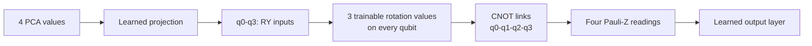

# Framingham MSE HQMLP PCA-4 architecture

Model ID: **framingham-hqmlp-mse-pca4**  
Portal status: evidence only  
Purpose: paper-style hybrid-loss comparison

## Training snapshot

Each of three seeds used **256 training rows** and **597 held-out test rows**. Training allowed up to **12 epochs** with early stopping. Adam used a 0.01 learning rate and 0.0001 weight decay. The model learned **37 values**: 25 classical and 12 quantum.

## Architecture

```mermaid
flowchart LR
    A["Prepared Framingham data"]
    B["PCA<br/>4 values"]
    C["Classical 4-to-4 projection"]
    D["Four-qubit RY encoding"]
    E["Trainable U3-style rotations"]
    F["Linear CNOT chain"]
    G["Measure all 4 qubits"]
    H["Classical output"]
    I["MSE training loss"]
    J["Calibrated CHD research class"]
    A --> B --> C --> D --> E --> F --> G --> H --> I --> J
```

## Hybrid circuit flow

This ablation keeps the same hybrid shape as the BCE model but changes the quantum rotations and trains with mean-squared error.

## Evidence boundary

This is an evidence-only simulator comparison. The paper-style loss does not make it clinically validated.

## Implementation sources

- qml-research/src/qml_research/ehr_ihd/models.py
- qml-research/src/qml_research/framingham/benchmark.py

