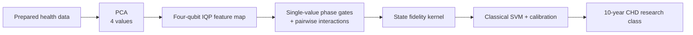
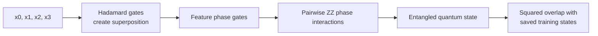

# Framingham IQP QKSVM PCA-4 architecture

Model ID: **framingham-iqp-qksvm-pca4**  
Portal status: evidence only  
Purpose: entangled quantum-kernel comparison for the Framingham teaching cohort

## Training snapshot

Each of three seeds used **256 training rows** and **597 held-out test rows**. The circuit has no learned weights or epochs. The classical SVM strength was chosen from 0.1, 1.0, and 10.0 using tuning data.

## Architecture

## Four-qubit circuit flow

Unlike simple angle encoding, the IQP map mixes feature pairs inside the quantum state before similarity is measured.

## Evidence boundary

The states were generated on an ideal simulator and compared with classical matrix operations. This is not a hardware or speedup result.

## Implementation sources

- qml-research/src/qml_research/framingham/benchmark.py
- qml-research/src/qml_research/quantum/kernels.py

