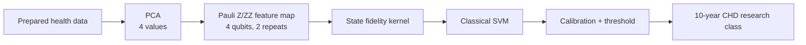
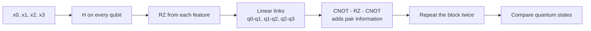

# Framingham Pauli QKSVM PCA-4 architecture

Model ID: **framingham-pauli-qksvm-pca4**  
Portal status: evidence only  
Purpose: Pauli Z/ZZ quantum-kernel comparison

## Training snapshot

Each audited seed used **256 training rows** and **597 held-out test rows**. There are no learned circuit weights or epochs. The Pauli map repeats twice, and the SVM strength was selected from 0.1, 1.0, and 10.0.

## Architecture

## Pauli circuit flow

The single-qubit phases hold individual features; the linked gates add relationships between neighboring features.

## Evidence boundary

This is a local exact-statevector experiment. The portal keeps its evidence but does not serve new predictions from it.

## Implementation sources

- qml-research/src/qml_research/framingham/benchmark.py
- qml-research/src/qml_research/ehr_ihd/models.py

