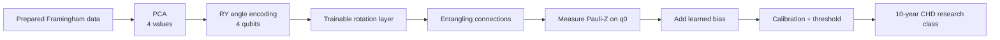
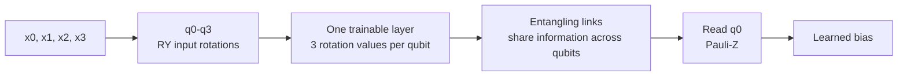

# Framingham VQC PCA-4 architecture

Model ID: **framingham-vqc-pca4**  
Portal status: evidence only  
Purpose: trainable variational quantum comparison

## Training snapshot

Each of three seeds used **256 training rows** and **597 held-out test rows**. Training ran for **30 optimizer steps** with batches of 16. Adam used a 0.05 learning rate to learn **13 values**: 12 circuit rotation values and one output bias.

## Architecture

## Four-qubit circuit flow

Unlike a quantum-kernel model, this circuit learns its own rotation values during training.

## Evidence boundary

This was a bounded simulator experiment on teaching data. It is not available for new portal predictions and is not clinical evidence.

## Implementation sources

- qml-research/src/qml_research/quantum/vqc.py
- qml-research/src/qml_research/framingham/benchmark.py

