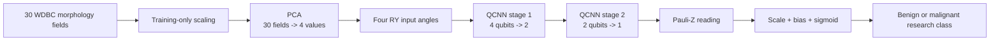
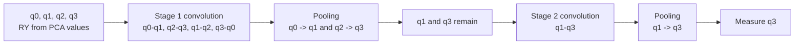

# WDBC four-qubit QCNN architecture

Model ID: **imaging-wdbc-qcnn**  
Portal status: evidence only  
Purpose: breast-mass morphology control experiment

## Training snapshot

Two small folds were recorded. Each fold used **16 training records**, **8 validation records**, and **16 test records**, with **1 epoch** and batches of 8. Adam used a 0.01 learning rate, 0.0001 weight decay, and 0.05 starting scale. Each fold learned **38 values**. This WDBC entry uses numeric morphology features, not medical images.

## Architecture

## Circuit-level qubit flow

The circuit shape matches the BreastMNIST QCNN. The important difference is the input: four PCA values from WDBC tabular measurements replace four pooled image regions.

## Saved weights

| Weight group | Values | Purpose |
| --- | ---: | --- |
| Convolution weights | 30 | Learn pair patterns across two stages |
| Pooling weights | 6 | Control which information continues |
| Output scale and bias | 2 | Convert the final reading into a score |
| **Total** | **38** | Learned values per fold |

## Evidence boundary

These were two tiny, one-epoch control folds. The entry is evidence only and is not a screening or diagnostic system.

## Implementation sources

- qml-research/src/qml_research/qcnn/quantum.py
- qml-research/results/qcnn_breast_cancer/runs/4209ff4c4f241129
- qml-research/results/qcnn_breast_cancer/runs/b0fccd3f82ab8ce8

