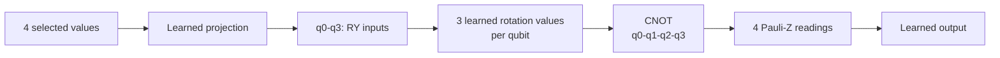

# UCI paper-loss HQMLP architecture

Model ID: **uci-hqmlp-paper-ablation**  
Portal status: evidence only  
Purpose: alternate hybrid architecture and loss comparison

## Training snapshot

The model used a balanced subset of **50 training patients**, with **45 validation** and **46 test patients**. It trained for **3 epochs** with Adam, a 0.01 learning rate, and 0.0001 weight decay. It learned **37 values**: 25 classical and 12 quantum.

## Architecture

## Hybrid circuit flow

This comparison changes the trainable quantum rotations and uses mean-squared error instead of the preferred binary loss.

## Evidence boundary

This is a small research ablation, not a validated medical model.

## Implementation sources

- qml-research/src/qml_research/ehr_ihd/models.py
- qml-research/results/ehr_ihd_qml/uci-smoke-20260829T194302Z-3b55c98a85f0

