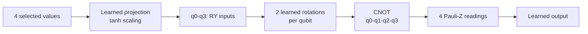

# UCI preferred BCE HQMLP architecture

Model ID: **uci-hqmlp-preferred**  
Portal status: evidence only  
Purpose: hybrid Cleveland heart-disease presence classifier

## Training snapshot

The model used a balanced subset of **50 training patients**, with **45 validation** and **46 test patients**. It trained for **3 epochs** with Adam, a 0.01 learning rate, and 0.0001 weight decay. It learned **33 values**: 25 classical and 8 quantum.

## Architecture

```mermaid
flowchart LR
    A["Cleveland patient record"]
    B["4 selected fields<br/>thal, cp, thalach, ca"]
    C["Classical 4-to-4 projection"]
    D["RY encoding on 4 qubits"]
    E["Trainable RY + RZ gates"]
    F["CNOT chain"]
    G["Measure all qubits"]
    H["Classical output + calibration"]
    I["Heart-disease presence class"]
    A --> B --> C --> D --> E --> F --> G --> H --> I
```

## Hybrid circuit flow

The model combines small classical layers with one four-qubit trainable layer. It uses class-weighted binary cross-entropy.

## Evidence boundary

This is a single-seed smoke test and is not available for new portal predictions or clinical use.

## Implementation sources

- qml-research/src/qml_research/ehr_ihd/models.py
- qml-research/results/ehr_ihd_qml/uci-smoke-20260829T194302Z-3b55c98a85f0

