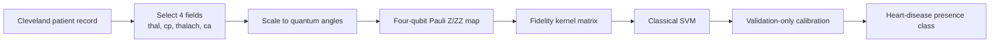

# UCI Pauli OQSVM architecture

Model ID: **uci-oqsvm-pauli**  
Portal status: evidence only  
Purpose: Cleveland heart-disease presence classification

## Training snapshot

The quantum kernel used a balanced subset of **50 training patients**, with **45 validation** and **46 test patients**. It has no epochs or learned gate weights. Validation compared SVM C values 0.1 and 1.0 and selected **0.1**. The circuit used four qubits, two Pauli-map repeats, and ideal statevector simulation.

## Architecture

## Pauli circuit flow

The circuit creates patient-to-patient similarities. The SVM, calibration, and final decision remain classical.

## Evidence boundary

This was one small diagnostic smoke test. It does not predict future disease and is unavailable for new portal predictions.

## Implementation sources

- qml-research/src/qml_research/ehr_ihd/models.py
- qml-research/results/ehr_ihd_qml/uci-smoke-20260829T194302Z-3b55c98a85f0

